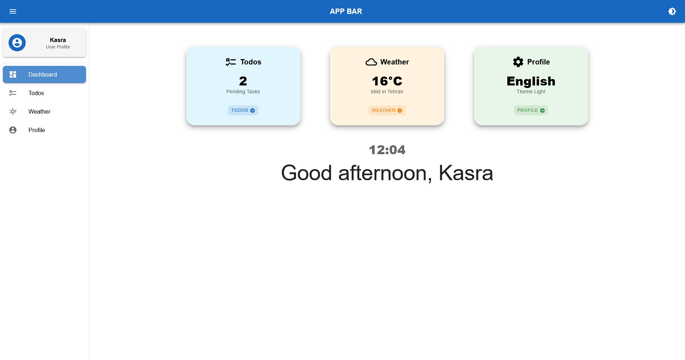

# NADINSOFT-VUETASK  
## Advanced Vue 3 + TypeScript + Vuetify 3 SPA with Cypress E2E Testing

> **A production-ready, fully typed, bilingual (EN/FA), responsive task management app** with **end-to-end testing** powered by **Cypress**.


---

## Screenshot

<div align="center">
  
  <br/>
  <sub><b>Main Dashboard – Dark Mode (Farsi RTL)</b></sub>
</div>

---

## Features

| Feature | Implementation |
|-------|----------------|
| **Bilingual UI (EN/FA)** | Full RTL/LTR support with dynamic `dir` switching |
| **Persistent Settings** | Theme, locale, user name saved to `localStorage` |
| **Responsive Design** | Mobile-first layout using Vuetify 3 Grid |
| **Todo Management** | Add, edit, delete, filter, sort, toggle completion |
| **Weather Dashboard** | Real-time data via **Open-Meteo API** |
| **Profile & Settings** | Personalized dashboard with full control |
| **End-to-End Testing** | **Cypress** tests for all critical user flows |

---

## Project Structure

```bash
src/
├── assets/              
│   └── screenshots/     
│       └── mainpage.png 
├── components/          
│   ├── FirstVisitModal.vue
│   ├── NotificationSystem.vue
│   ├── TheAppBar.vue
│   └── TheSidebar.vue
├── data/                
│   └── iran-cities.json
├── i18n/                
│   ├── index.ts
│   └── locales/
├── router/              
├── services/            
├── stores/              
│   ├── notifications.ts
│   ├── settings.ts
│   ├── todos.ts
│   └── weather.ts
├── views/               
│   ├── DashboardView.vue
│   ├── ProfileView.vue
│   ├── TodosView.vue
│   └── WeatherView.vue
├── App.vue
├── main.ts
└── env.d.ts

cypress/
├── e2e/                 
├── fixtures/
├── support/
└── cypress.config.ts